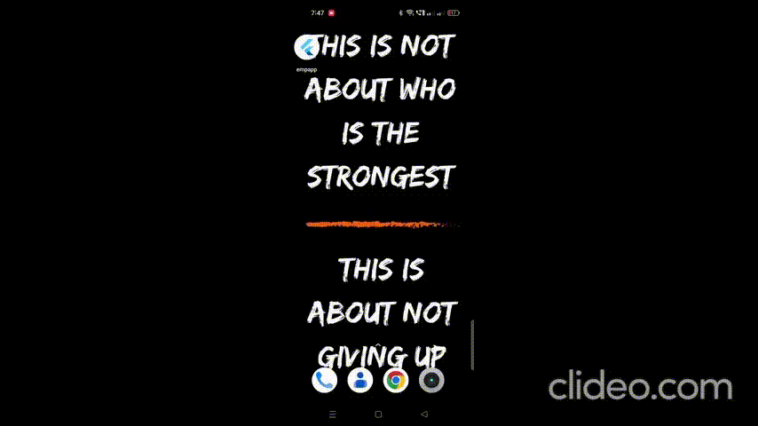

# app

## Getting Started

<video src="https://codeinvesto.com/upload/app-emp-demo.mp4" data-canonical-src="https://codeinvesto.com/upload/app-emp-demo.mp4" controls="controls" muted="muted" class="d-block rounded-bottom-2 border-top width-fit" style="max-height:640px; min-height: 200px">
</video>

[](https://codeinvesto.com/upload/app-emp-demo.mp4)

[](http://commondatastorage.googleapis.com/gtv-videos-bucket/sample/BigBuckBunny.mp4)

[](video2.mp4)

[![App Demo Video]](video2.mp4)

[Watch the App Demo Video](https://www.youtube.com/watch?v=g0GNuoCOtaQ)




Code for npm
    ```sudo npm i
    sudo npm start```

    ``` cpp
bool getBit(int num, int i) {
    return ((num & (1<<i)) != 0);
}
```

# open_ngo
This is a flutter UI challenege project, where I will take on UI design and will try to implement that in Flutter.

# UI challenge

The [original](https://dribbble.com/shots/5702327-Charity-Non-Profit-App-Freebie-Day-348-365-Project365?utm_source=Clipboard_Shot&utm_campaign=elitepixels&utm_content=Charity%2FNon-Profit%20App%20-%20Freebie%20%7C%20Day%20348%2F365%20-%20Project365&utm_medium=Social_Share) design is 

<br/>


Please note that as I have the screenshots only and not exact measurements, fonts, colors, the implementation would vary from the design.

## Let's build

# 1. Login page
The login page I developed looks like
<br/>
<br/>


Close enough right? :smirk:

# 2. Landing Page
So my implementation looks like
<br/>
<br/>


Could not find the heart icon in flutter Icons, hence the alteration. Still pretty close though :boom:

# 3. Charities page
This is what I built
<br/>
<br/>


Altered the user's picture here, for obvious reasons :joy:

<br/>

# 3. Charity details page
Tried to replicate as much as I could
<br/>
<br/>


Looks pretty good to me :heartpulse:


# This is pretty much what I wanted to achieve

<br/>
<br/>


For help getting started with Flutter, view our 
[online documentation](https://flutter.io/docs), which offers tutorials, 
samples, guidance on mobile development, and a full API reference.
</br>

## Author

* ** Sgh ** - [twitter](https://twitter.com/aritra__das)

* 
